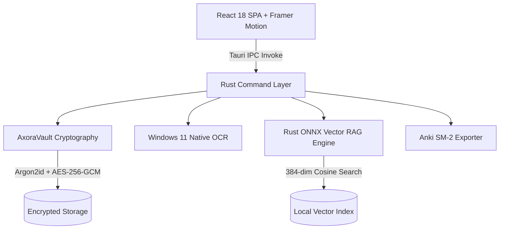
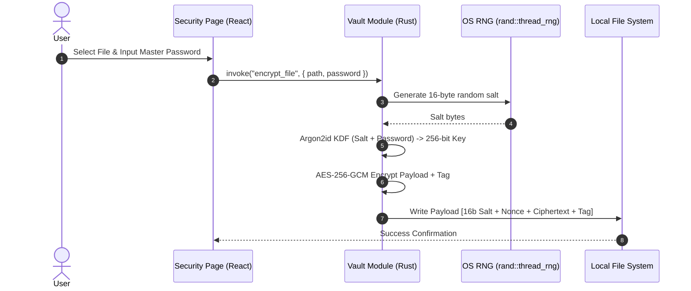
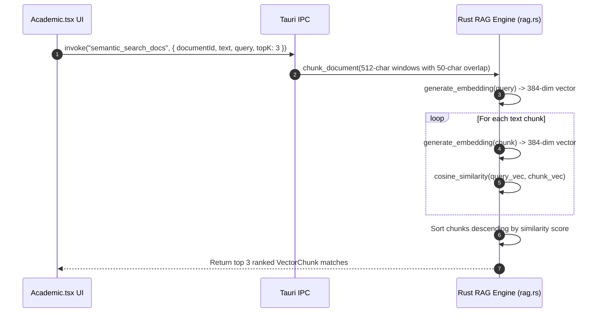

# Axora Desktop — Architecture Specification

This document details the architectural design, cryptographic protocols, data flows, and IPC command pipelines powering **Axora Desktop**.

---

## 1. System Overview

---

## 2. Cryptographic Protocol & Vault Specifications

Axora Desktop implements a zero-trust per-file encryption protocol:

---

## 3. Local ONNX Vector RAG Engine

---

## 4. SuperMemo-2 (SM-2) Spaced Repetition Protocol

Interval update rules calculated by the Rust SM-2 engine:

$$EF' = EF + (0.1 - (5 - q) \times (0.08 + (5 - q) \times 0.02))$$

$$I(n) = \begin{cases} 1 & n = 1 \\ 6 & n = 2 \\ I(n-1) \times EF' & n > 2 \end{cases}$$

Where $q \in [0, 5]$ represents the user quality grade rating.
