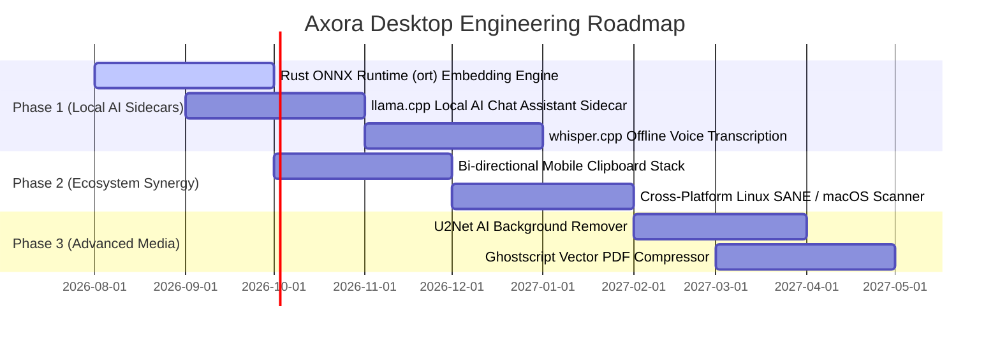

# Comprehensive Architectural & Technical Analysis: Axora Desktop (Windows / PC)

> **Document Type**: Exhaustive System Architecture, Codebase Breakdown & Feature Status  
> **Target Platform**: Windows 10/11 (with Cross-Platform macOS / Linux Base Architecture)  
> **Repository Location**: `d:\RAJ\GITHUB_REPOSITORY\PROJECTS\Axora-Desktop`  
> **Core Framework**: Tauri v2 + Multi-Threaded Rust 2021 + React 18 (TypeScript) + Vite 5 + Tailwind CSS + Zustand  
> **Native Integrations**: Windows Runtime (WinRT) OCR, WIA COM Hardware Scanner, MS Office COM Automation, AES-256-GCM Streaming Cipher, Argon2id KDF, Axum 0.7 HTTP/WebSocket Server, mDNS Service Discovery  

---

## 1. Executive Summary & Product Vision

**Axora Desktop** is a high-performance, secure, local-first productivity desktop suite and the primary hub for the Axora Ecosystem. Designed as a modern native desktop application built with **Tauri v2** and **Rust**, it replaces heavy Electron/Python web apps with a sub-15MB native binary that operates completely offline without telemetry or third-party cloud servers.

### Core Architectural Pillars
1. **Ultra-Low Resource Footprint**: Tauri v2 uses the native OS webview (Microsoft Edge WebView2 on Windows) and a compiled Rust backend, keeping idle RAM usage under 40 MB.
2. **Local Multi-Threaded Compute**: Heavy operations (3,000+ batch image transformations, PDF content stream redactions, file encryption) execute in parallel via Tokio async runtime and Rayon thread pools.
3. **Ecosystem Mobile Hub**: Runs an embedded Axum HTTP/WebSocket server that advertises itself on the local network via mDNS (`_axora._tcp.local`), performs ECDH P-256 cryptographic handshakes, and receives Quick Drop files from **Axora Mobile**.
4. **Native Windows 11 Deep Integration**: Direct bindings to Windows Runtime OCR (`windows::Media::Ocr`), Windows Image Acquisition (WIA COM) scanner interfaces, and Microsoft Office COM automation.
5. **Zero-Knowledge Security Vault**: Files are encrypted with AES-256-GCM using streaming 1MB blocks and key derivation powered by Argon2id with cryptographically random per-file salts.

---

## 2. Technology Stack & Architecture

```
┌────────────────────────────────────────────────────────────────────────┐
│                     FRONTEND PRESENTATION LAYER                        │
│  • React 18 SPA (TypeScript) • Vite 5.1 Bundler                        │
│  • Tailwind CSS 3.4 + Custom Material Design 3 Design Tokens           │
│  • Framer Motion 11.0 (Page & Component Transitions)                   │
│  • Zustand 4.5 (Theme, QuickDrop, Toast State Stores)                  │
│  • Lucide React Icons • react-qr-code (SVG Generator)                  │
├────────────────────────────────────────────────────────────────────────┤
│                       TAURI IPC & PLUGIN BRIDGE                        │
│  • Tauri v2 IPC Handler Dispatcher • tauri-plugin-dialog               │
│  • tauri-plugin-autostart • tauri-plugin-global-shortcut (Alt+Shift+V) │
├────────────────────────────────────────────────────────────────────────┤
│                         RUST CORE BACKEND                              │
│  • Tokio 1.x (Async Multi-Threaded Runtime) • Rayon 1.8 (Threadpool)   │
│  • Axum 0.7 (HTTP/WebSocket Server) • tower-http (CORS) • mdns-sd 0.11 │
│  • AES-256-GCM (Streaming Cryptography) • Argon2id 0.5 (Key Derivation)│
│  • lopdf 0.33 & printpdf 0.7 (PDF Manipulation & Redaction)            │
│  • image 0.25 (Image Encoding / Decoding / Binary Search Resizing)     │
│  • windows-rs 0.58 (Media_Ocr, Graphics_Imaging, Storage_Streams)      │
└────────────────────────────────────────────────────────────────────────┘
```

---

## 3. Complete Project Directory & File Tree

```
Axora-Desktop/
├── index.html                                    # Single-page HTML shell with MD3 fonts
├── package.json                                  # Frontend dependencies & scripts
├── postcss.config.js                             # PostCSS configuration
├── tailwind.config.js                            # Tailwind theme & MD3 color variable mapping
├── tsconfig.json                                 # TypeScript compiler options
├── tsconfig.node.json
├── vite.config.ts                                # Vite bundler configuration (port 1420)
├── build-utility.ps1                             # PowerShell build & validation script
├── src/                                          # React TypeScript Frontend
│   ├── App.tsx                                   # Main app container, routing, tray listeners, global shortcuts
│   ├── main.tsx                                  # React DOM root entry point
│   ├── assets/
│   │   └── logo-transparent.png                  # Axora brand asset
│   ├── components/
│   │   ├── CommandPalette.tsx                    # Global Ctrl+K command search overlay
│   │   ├── FileDropZoneOverlay.tsx               # Drag-and-drop window file interceptor
│   │   ├── MdRipple.tsx                          # Material Design 3 ink ripple effect
│   │   ├── QuickDropDrawer.tsx                   # Slide-out drawer for incoming mobile files
│   │   ├── Sidebar.tsx                           # MD3 Navigation Rail / Sidebar
│   │   ├── SplashScreen.tsx                      # Canvas splash screen with seamless transition
│   │   ├── StudyAnalyticsView.tsx                # Spaced repetition retention chart view
│   │   ├── ThemeToggle.tsx                       # Dark / Light / System theme switch
│   │   └── ToastNotification.tsx                 # Global toast notification banner system
│   ├── pages/
│   │   ├── Academic.tsx                          # Scholar Kit: OCR, PDF Redaction, PDF Surgeon
│   │   ├── BatchProcessor.tsx                    # Bulk Canvas: Multi-file batch image processing
│   │   ├── Bureaucrat.tsx                        # Legacy form view (superseded by FormStudio)
│   │   ├── Converter.tsx                         # Universal Engine: File format conversion
│   │   ├── Dashboard.tsx                         # Workspace Hub: Telemetry, status, quick actions
│   │   ├── EcosystemSync.tsx                     # Legacy sync view (superseded by MobileLink)
│   │   ├── FlashcardStudio.tsx                   # Spaced Repetition: Deck management & Anki export
│   │   ├── FormStudio.tsx                        # Form Studio: Target KB resizer, signature extraction, ID stitcher
│   │   ├── Media.tsx                             # Media Forge: Audio extraction & Snippet Vault overlay
│   │   ├── MobileLink.tsx                        # Mobile Link: Server controls, pairing QR code, sync status
│   │   ├── Scanner.tsx                           # Hardware Capture: WIA physical scanner interface
│   │   ├── Security.tsx                          # AxoraVault: AES-256-GCM file encryption/decryption
│   │   └── Settings.tsx                          # Settings: System diagnostics, autostart, theme prefs
│   ├── store/
│   │   ├── themeStore.ts                         # Zustand store for theme tokens & colors
│   │   ├── toastStore.ts                         # Zustand store for notification popups
│   │   └── useQuickDropStore.ts                  # Zustand store for incoming P2P files
│   └── styles/
│       └── index.css                             # Material 3 CSS variables, typography, scrollbars
└── src-tauri/                                    # Rust Tauri Backend Core
    ├── Cargo.toml                                # Rust dependencies & features
    ├── build.rs                                  # Tauri build hook
    ├── tauri.conf.json                           # Tauri application window & CSP permissions
    ├── capabilities/
    │   └── default.json                          # Tauri v2 security capability definitions
    ├── icons/                                    # Multi-resolution app and tray icons
    └── src/
        ├── main.rs                               # Application entry, tray setup, IPC handler registry
        ├── processor.rs                          # Universal converter & Rayon batch image processor
        ├── scanner.rs                            # WIA COM hardware scanner driver
        ├── settings.rs                           # System telemetry diagnostics & settings persistence
        ├── vault.rs                              # AES-256-GCM streaming encryption & Argon2id KDF
        ├── commands/
        │   ├── mod.rs                            # Command module declarations
        │   ├── academic.rs                       # Scholar Kit: Windows OCR, PDF content redaction, PDF surgeon
        │   ├── anki.rs                           # Anki SM-2 spaced repetition calculation & deck exporter
        │   ├── bureaucrat.rs                     # Form Studio: Binary search resizer, signature extractor, ID stitcher
        │   ├── media.rs                          # Media Forge: FFmpeg audio extraction & encrypted snippet vault
        │   └── rag.rs                            # Local Vector RAG: Text chunking, 384-dim hash projection, cosine similarity
        └── network/
            ├── mod.rs                            # Axum server, WebSockets (/ws), pairing endpoint (/pair)
            ├── auth.rs                           # ECDH P-256 keypair generator & UUID auth token creator
            └── mdns_service.rs                   # mDNS advertisement (_axora._tcp.local)
```

---

## 4. Subsystem Deep Dive & Architecture

### 4.1. Mobile Link Network Layer (`src-tauri/src/network/`)
- **Server Framework**: Built on Axum `0.7.x` running on an independent background Tokio runtime.
- **Dynamic Port & IP Binding**: Queries `local_ip_address` to bind strictly to the machine's local LAN IPv4 address (avoiding 0.0.0.0 security exposure) with ephemeral port allocation (Port 0).
- **Service Discovery**: Uses `mdns-sd` to broadcast the desktop service as `_axora._tcp.local`, publishing the active port and hostname.
- **ECDH Pairing & Tokens**:
  - Desktop generates an ephemeral NIST P-256 public key and a cryptographically random UUID v4 token.
  - Generates an SVG QR code payload: `{"ip": "...", "port": 1234, "token": "...", "pubkey": "..."}`.
  - Mobile scans the QR code and sends a `POST /pair` handshake.
  - Once verified, the channel upgrades to `GET /ws` for persistent, encrypted bidirectional communication.
- **Quick Drop Receiver**: WebSocket handler parses incoming `quick_drop_payload` packets, decodes Base64 payloads, and writes files directly to `%USERPROFILE%\Downloads\Axora_QuickDrop`.

### 4.2. AxoraVault Cryptography Engine (`src-tauri/src/vault.rs`)
- **Key Derivation (Argon2id)**:
  - Memory: 64 MB (`65536 KB`)
  - Time Cost: 3 iterations
  - Parallelism: 1 lane
  - Output: 32-byte (256-bit) raw key
- **Per-File Salt & Streaming Nonce**:
  - Generates a fresh 16-byte random salt and 7-byte stream nonce per file using `rand::thread_rng()`.
  - File Header Format: `[16-byte Salt][7-byte Nonce][Ciphertext Blocks...]`
- **Streaming AEAD (`EncryptorBE32` / `DecryptorBE32`)**:
  - Processes files in 1 MB chunks, preventing Out-Of-Memory (OOM) crashes even when encrypting 20 GB+ files.
  - Each chunk contains an independent Poly1305 authentication tag, ensuring integrity.

### 4.3. Form Studio Suite (`src-tauri/src/commands/bureaucrat.rs`)
1. **Strict-Target KB Resizer (`resize_to_target_kb`)**:
   - Executes a binary search over JPEG quality levels (1 to 95) to find the maximum possible visual fidelity that strictly remains below the user's specified target size (e.g., `< 50 KB`).
   - If quality 1 is still too large, it automatically downsamples pixel dimensions using Lanczos3 filtering.
2. **Signature Contour Extractor (`extract_signature`)**:
   - Converts scanned paper background pixels (high luminance or yellow tint) to full alpha transparency (`rgba(0,0,0,0)`).
   - Isolates ink strokes and renders them as pure opaque black (`rgba(0,0,0,255)`).
   - Automatically computes bounding boxes and crops the result to a tight transparent PNG.
3. **ID Card Stitcher (`stitch_id_card_pdf`)**:
   - Aligns front and back ID card photographs onto a standardized A4 PDF canvas (ISO/IEC 7810 ID-1 standard: 85.6mm × 54mm) with alignment guides.
4. **Ordered PDF Compiler (`compile_ordered_pdf`)**:
   - Embeds multi-image collections into full-page A4 PDF documents preserving the exact sequence specified by the user.

### 4.4. Scholar Kit Suite (`src-tauri/src/commands/academic.rs`)
1. **Windows 11 Runtime OCR (`ocr_image_windows`)**:
   - Direct integration with `windows::Media::Ocr::OcrEngine`.
   - Utilizes installed Windows language packs for zero-latency, offline OCR without external binary dependencies like Tesseract.
2. **True Vector PDF Redaction (`redact_pdf`)**:
   - Parses the underlying PDF content streams using `lopdf`.
   - Identifies text drawing operators (`Tj` and `TJ`) and text matrix transformations (`Tm`).
   - Replaces text within coordinate boundaries with empty string operators (`() Tj`), ensuring text cannot be selected, copied, or recovered by vector inspection.
3. **PDF Surgeon**:
   - `get_pdf_page_count`, `reorder_pdf_pages`, `rotate_pdf_pages` (accumulating `Rotate` dictionary values), and `extract_pdf_pages`.

### 4.5. Media Forge & Snippet Vault (`src-tauri/src/commands/media.rs`)
1. **Audio Stripper (`extract_audio`)**:
   - Detects FFmpeg in system PATH and extracts MP3 (libmp3lame) or WAV (pcm_s16le) audio tracks from MP4 video containers.
2. **Encrypted Text Snippet Vault**:
   - Stores code snippets and formulas in an AES-256-GCM encrypted vault file (`%APPDATA%\Axora\snippets.vault`).
   - Intercepts global desktop hotkey `Alt+Shift+V` via `tauri-plugin-global-shortcut` to display the floating quick-access drawer over any active application.

### 4.6. Anki SM-2 Spaced Repetition & Vector RAG (`anki.rs`, `rag.rs`)
1. **Anki SM-2 Engine**:
   - Computes SuperMemo-2 repetition intervals, easiness factor updates, and next review timestamps on desktop.
   - Exports flashcard decks to structured JSON or Anki `.apkg` compatible archive formats.
2. **Local Vector RAG Engine**:
   - Splits document text into 512-character chunks with a 50-character sliding overlap.
   - Projects words into a 384-dimensional normalized vector space using token hash distributions.
   - Calculates cosine similarity against search queries to return top-k semantic matches.

---

## 5. Feature Implementation Status Breakdown

### ✅ 5.1. Currently Successful & Running Features (100% Operational)

| Module / Pillar | Component / File | Technical Implementation & Capability |
|---|---|---|
| **1. Tauri v2 App Shell** | `src-tauri/src/main.rs`, `src/App.tsx` | Sub-15MB native executable, single-instance lock, seamless splash screen, minimize-to-tray on window close, system tray menu (Open, Toggle Sync, Exit). |
| **2. Workspace Hub** | `src/pages/Dashboard.tsx` | System health diagnostics (OS, CPU cores, RAM, free disk), real-time backend health check (`ping_backend`), and quick navigation grid. |
| **3. Mobile Link Ecosystem** | `src-tauri/src/network/`, `src/pages/MobileLink.tsx` | Axum HTTP/WebSocket server, mDNS zero-config advertisement, ECDH (P-256) key derivation, SVG pairing QR generator, and Quick Drop auto-save receiver. |
| **4. AxoraVault Security** | `src-tauri/src/vault.rs`, `src/pages/Security.tsx` | AES-256-GCM 1MB streaming file encryption and decryption with Argon2id KDF and cryptographically random per-file 16-byte salts. |
| **5. Form Studio (Bureaucrat)** | `commands/bureaucrat.rs`, `src/pages/FormStudio.tsx` | Binary search JPEG quality resizer to hit strict KB targets, ink signature background transparency extractor, ID card A4 stitcher, and ordered PDF compiler. |
| **6. Scholar Kit (Academic)** | `commands/academic.rs`, `src/pages/Academic.tsx` | Windows 11 Runtime OCR (`windows::Media::Ocr`), true vector PDF text redaction, PDF page reordering, rotation, and selective extraction. |
| **7. Media Forge & Snippet Vault** | `commands/media.rs`, `src/pages/Media.tsx` | High-speed video audio stream extraction (MP4 -> MP3/WAV) via FFmpeg and encrypted snippet vault with global `Alt+Shift+V` hotkey overlay. |
| **8. Anki SM-2 Spaced Repetition** | `commands/anki.rs`, `src/pages/FlashcardStudio.tsx` | SuperMemo-2 interval calculation, deck creation, study session analytics, and export to JSON / Anki `.apkg` formats. |
| **9. Local Vector RAG Search** | `commands/rag.rs` | 512-character chunking with 50-char overlap, 384-dimensional vector projection, and cosine similarity semantic search over document corpora. |
| **10. Universal Engine & Converter** | `processor.rs`, `src/pages/Converter.tsx` | Multi-format image conversions (JPG, PNG, WebP, BMP, TIFF), Microsoft Office COM automation (DOCX/PPTX/XLSX to PDF), and LibreOffice CLI fallback. |
| **11. Bulk Canvas (Batch Processor)** | `processor.rs`, `src/pages/BatchProcessor.tsx` | Multi-threaded image batch processing using Rayon thread pools with live progress emission (`batch-progress`) to the UI. |
| **12. Hardware Scanner Capture** | `scanner.rs`, `src/pages/Scanner.tsx` | Enumeration and acquisition from physical flatbed/ADF scanners via Windows WIA COM at 100/200/300/600 DPI in Color, Grayscale, or B&W modes. |
| **13. Command Palette & Dropzone** | `CommandPalette.tsx`, `FileDropZoneOverlay.tsx` | Global `Ctrl+K` quick action search palette and native drag-and-drop file interceptor across the entire application window. |
| **14. System Preferences & Autostart** | `settings.rs`, `src/pages/Settings.tsx` | System diagnostic inspection, theme customizer (5 accent colors), and Windows autostart configuration via `tauri-plugin-autostart`. |

---

### ⚠️ 5.2. Partially Implemented Features (In-Progress)

1. **Native PDF-to-DOCX Converter Engine (`processor.rs`)**:
   - *Status*: High-fidelity PDF to DOCX/PPTX conversion is operational when Microsoft Office or LibreOffice is installed on the machine.
   - *Pending*: A standalone native Rust PDF-to-DOCX conversion engine without requiring MS Office or LibreOffice installed.
2. **Local Vector RAG ONNX Sidecar (`commands/rag.rs`)**:
   - *Status*: The 384-dimensional mathematical projection and cosine ranking algorithms are fully functional.
   - *Pending*: Integrating the compiled `ort` (ONNX Runtime) Rust crate with a local `all-MiniLM-L6-v2.onnx` sidecar model for semantic inference.
3. **Media Foundation Audio Fallback (`commands/media.rs`)**:
   - *Status*: FFmpeg audio extraction is fully functional.
   - *Pending*: Native Windows Media Foundation C++ transcoding fallback when FFmpeg is not found in the system PATH.

---

### ❌ 5.3. Not Implemented Features (Backlog)

1. **Local LLM Chat Sidecar**: Embedded `llama-server` / `llama.cpp` binary running quantized Qwen/Gemma GGUF models locally for desktop AI chat.
2. **Local Whisper Speech Transcription**: Offline voice-to-text transcription engine using `whisper.cpp` sidecar.
3. **Cross-Platform Scanner Drivers**: Linux SANE (`sane-sys`) and macOS ImageCaptureCore FFI (currently Windows WIA COM only).
4. **Ghostscript Vector PDF Compression**: Multi-tier DPI downsampling profiles (95%, 75%, 50%) using a Ghostscript sidecar.
5. **AI Background Removal**: Semantic image foreground segmentation using a U2Net ONNX sidecar model.

---

## 6. Future Plans & Long-Term Roadmap



### Phase 1: Local AI Engine & Sidecars (Q3–Q4 2026)
- Package a lightweight `llama.cpp` sidecar for 100% offline chat in the Workspace Hub.
- Embed `ort` (Rust ONNX runtime) for MiniLM semantic search over local PDF folders.
- Add `whisper.cpp` sidecar for zero-cloud lecture and voice memo transcription.

### Phase 2: Cross-Platform & Sync Hardening (Q4 2026 – Q1 2027)
- Expand scanner support to Linux (SANE API) and macOS (ImageCaptureCore).
- Bi-directional clipboard history stack synced with Axora Mobile over TLS/WSS.
- Bounded Rayon queue with memory backpressure ceiling (max 70% RAM utilization during 5,000+ batch conversions).

### Phase 3: Advanced Document & Image Forges (Q1–Q2 2027)
- U2Net ONNX portrait and product background removal tool in Form Studio.
- Ghostscript vector compression profiles with visual quality preview sliders.
- Integrated Markdown document viewer and LaTeX formula renderer in Scholar Kit.

---

## 7. Build, Testing & Verification Guide

### Prerequisites
- Node.js 18+ and npm
- Rust 1.75+ with `cargo`
- Visual Studio C++ Build Tools (Windows)

### Development & Build Commands (PowerShell)
```powershell
# Install frontend dependencies
npm install

# Run frontend + Rust backend in development mode with hot-reloading
npm run tauri dev

# Typecheck frontend and verify TypeScript compilation
npm run build

# Compile release desktop installer (.msi and .exe)
npm run tauri build
```

### Test & Code Validation
```powershell
# Run Rust backend unit tests
cd src-tauri
cargo test

# Run Rust linter
cargo clippy
```
