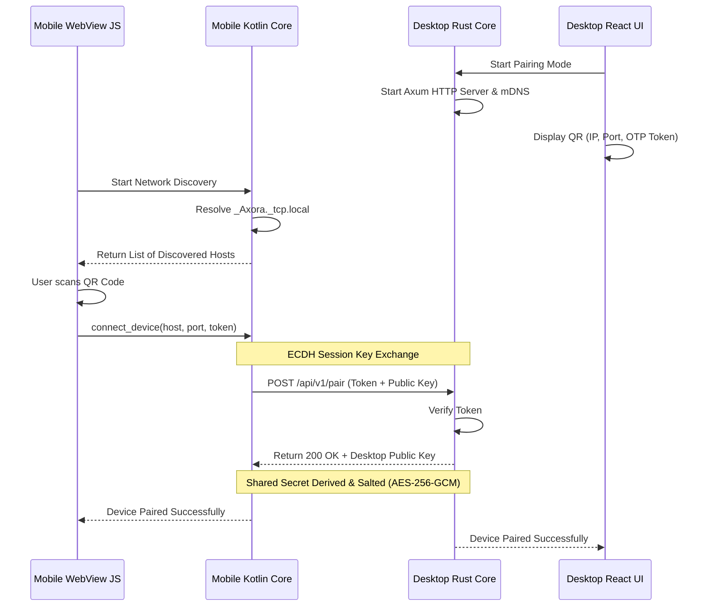

# Axora Ecosystem: Desktop-Mobile Alignment Blueprint

This document details how the fresh **Axora Desktop** (Tauri v2 + Rust) aligns with **Axora Mobile** (Kotlin WebView-based Hybrid) to establish a unified, secure, local-first ecosystem.

---

## 1. Analysis of Existing Mobile Architecture & Gaps

Analysis of the `Axora-Mobile` repository revealed its actual structure:
1. **WebView Hybrid Pattern**: The Jetpack Compose UI layer is vestigial scaffolding and is bypassed at runtime. `MainActivity.kt` directly instantiates a WebView loading a bundled SPA (`index.html`, `app.js`, `style.css`) from assets.
2. **Native JS Bridge (`AndroidBridge.kt`)**: The JS layer and native Kotlin layer communicate via an `@JavascriptInterface` bridge.
3. **Base64-in-JSON Communication**: Files are read into memory, converted to Base64-encoded strings, and passed as JSON parameters across the bridge. This causes high memory consumption and Out-of-Memory (OOM) crashes on files > 50MB.
4. **Zero IV Cryptography Vulnerability**: The AES encryption bridge methods (`encryptFile` / `decryptFile`) use a hardcoded zero initialization vector (`ByteArray(16)` containing all zeros), making it cryptographically insecure.
5. **No Networking Layer**: The mobile app has no Retrofit/OkHttp networking code. The "AxoraShare" feature in `app.js` is a simulated local pairing feature that does not write to the network.

```
┌─────────────────────────────────────────────────────────────────────────┐
│                           Axora ECOSYSTEM                          │
├────────────────────────────────────┬────────────────────────────────────┤
│         Axora Mobile          │         Axora Desktop         │
├────────────────────────────────────┼────────────────────────────────────┤
│ WebView SPA (index.html/app.js)    │ WebView SPA (React / TS / Vite)    │
│                 │                  │                 │                  │
│                 ▼                  │                 ▼                  │
│ AndroidBridge.kt (@JSInterface)    │ Tauri IPC Commands & Events        │
│                 │                  │                 │                  │
│                 ▼                  │                 ▼                  │
│ Native Kotlin (ML Kit Scanner,     │ Native Rust (Axum Web Server,      │
│ MediaPipe LLM, AES-256-CBC)        │ mdns-sd, ImageMagick, PDF engine)  │
└────────────────────────────────────┴────────────────────────────────────┘
```

---

## 2. Integrated Pairing & API Contract Specifications

To replace the simulated pairing code in the mobile app, both platforms will implement a secure local network protocol.

### 2.1 mDNS Service Discovery
The Desktop app advertises itself over the local network using the following mDNS parameters:
* **Service Name**: `Axora Desktop Core`
* **Service Type**: `_Axora._tcp.local`
* **TXT Records**:
  ```ini
  device_name=Hostname
  api_version=1.0.0
  port=DynamicPort (e.g. 49152)
  status=available
  ```

### 2.2 Pairing Sequence


---

## 3. API Contract Specifications (REST & WebSocket)

To align with the mobile app's data transfer requirements while resolving the Base64 memory overhead, all REST APIs will transition to **Multipart Form-Data Streaming** for file transfers.

### 3.1 Device Pairing Endpoint (`POST /api/v1/pair`)
* **Headers**: `Content-Type: application/json`
* **Payload**:
  ```json
  {
    "client_id": "android-uuid-here",
    "client_name": "Pixel 8 Pro",
    "pairing_token": "827409",
    "public_key": "HEX_ENCODED_ECDH_PUBLIC_KEY"
  }
  ```
* **Response**: `200 OK`
  ```json
  {
    "status": "success",
    "desktop_name": "AxoraPC-Desktop",
    "public_key": "HEX_ENCODED_DESKTOP_ECDH_PUBLIC_KEY"
  }
  ```

### 3.2 File Upload & Convert Endpoint (`POST /api/v1/convert`)
* **Headers**: `Content-Type: multipart/form-data`, `X-Client-Signature: HMAC_SHA256(Payload)`
* **Form Parameters**:
  * `file`: Binary file stream
  * `metadata`: JSON payload containing conversion options:
    ```json
    {
      "source_format": "PDF",
      "target_format": "DOCX",
      "preserve_layout": true
    }
    ```
* **Response**: `202 Accepted`
  ```json
  {
    "status": "queued",
    "task_id": "convert-task-uuid"
  }
  ```

### 3.3 Real-Time WebSocket Channel (`GET /api/v1/ws`)
Upon pairing, a persistent WebSocket channel is opened to stream task progress, connection heartbeats, and device telemetry:

```typescript
// WebSocket Message Wrapper
interface WebSocketMessage {
  type: "heartbeat" | "task_progress" | "clipboard_sync" | "disconnect";
  sender: "desktop" | "mobile";
  timestamp: number;
  payload: Record<string, any>;
}
```

---

## 4. Required Mobile Codebase Modifications

To enable integration with the new desktop application, the following modifications must be made to `Axora-Mobile`:

### 4.1 Native Kotlin Network Core (Additions)
* **`NsdHelper.kt` [NEW]**: Integrates Android's `NsdManager` to discover local `_Axora._tcp.local` services.
* **`PairingManager.kt` [NEW]**: Implements ECDH key exchange using Java's `KeyAgreement` and generates shared keys.
* **`LocalHttpClient.kt` [NEW]**: Configures OkHttp with custom timeouts and dynamic host endpoints. Implements Multipart uploads.

### 4.2 WebView Bridge Updates (`AndroidBridge.kt`)
* **`registerNetworkDevice(json)` [NEW]**: Allows the WebView to save paired devices.
* **`sendLocalFile(taskId, filePath, targetUri)` [NEW]**: Uploads local files to the desktop via the native OkHttp client, bypassing Base64 memory overhead in WebView.
* **`setStatusBarTheme` Fix**: Remove the duplicate method overloading in `AndroidBridge.kt` (lines 89 and 330) to prevent JS bridge failures.
* **Recycle Bitmaps**: Add `.recycle()` to bitmap objects inside `combineImagesToPdf()` (lines 633-643), `getCompiledPdfSize()` (lines 903-913), and `shareFileInternal()` (lines 1004-1013) to prevent OOM errors.

---

## 5. Security & Cryptographic Handshake Specs

1. **HMAC Message Authentication**: Since the local server runs over standard Wi-Fi (HTTP), all API calls must contain an `X-Client-Signature` header calculated using an HMAC-SHA256 hash of the request body, signed with the shared key derived during pairing.
2. **Dynamic Port Allocation**: The desktop server binds to a random free port on start (between `49152` and `65535`) rather than a hardcoded port, preventing port conflicts and unauthorized access.
3. **Device Authorizations**: If an unauthorized device attempts to call an API, the desktop automatically rejects the connection and logs the event.
