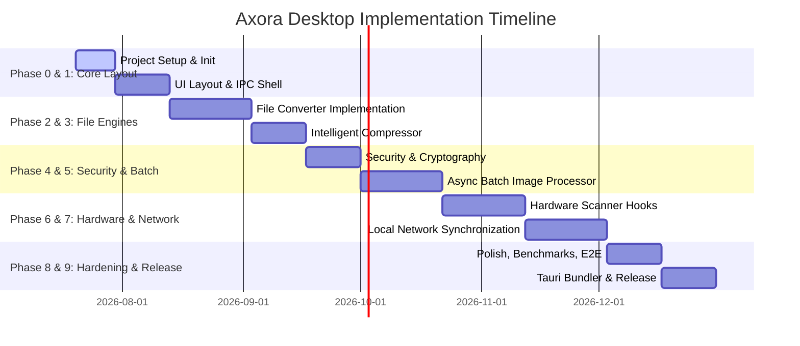

# Axora Desktop: Phased Implementation Roadmap

This document outlines the step-by-step development phases, milestone targets, dependencies, risks, and exit criteria for building **Axora Desktop** using **Tauri v2 + Rust + React**.

---

## Roadmap Timeline Summary

---

## Phase 0: Project Setup & Environment Initialization (Week 1–2)

Establish code quality gates, initialize the project repository, and configure development environments.

### 1. Objectives
* Initialize the Tauri v2 repository scaffolding.
* Set up linters, formatting checks, and security audits for Rust and TypeScript.
* Configure continuous integration (CI) workflows for automated build checks.

### 2. Deliverables
* Tauri v2 + React TypeScript workspace scaffolding.
* Configurations for ESLint, Prettier, Clippy, and `rustfmt`.
* GitHub Actions CI workflow verifying that the project compiles on Windows, macOS, and Linux.

### 3. Risks & Mitigations
* **Risk**: Rust compiler setup challenges on team member machines.
* **Mitigation**: Document environment requirements in a `SETUP.md` detailing how to install `libsoup`, `webkit2gtk`, and MSVC tools.

### 4. Exit Criteria
* Pull requests trigger CI workflows that pass build checks and linter gates.

---

## Phase 1: Core IPC Shell & Layout Design (Week 3–4)

Create the window shell, theme configurations, global state modules, and base IPC handlers.

### 1. Objectives
* Design the Gemini-inspired fluid, glassmorphic layout.
* Implement theme switching (Light/Dark/System Default) synchronized with OS settings.
* Set up global state stores and establish secure file access boundaries.

### 2. Deliverables
* React layout containing sidebar navigation, status bars, and active state styles.
* Global state stores using Zustand.
* Tauri filesystem capabilities configurations restricting operations outside user-authorized paths.

### 3. Exit Criteria
* Running `npm run tauri dev` opens a styled dark-themed window with functional routing, responsive layouts, and functioning theme switching.

---

## Phase 2: File Converter Engine (Week 5–7)

Build conversion pipelines for Office and PDF formats.

### 1. Objectives
* Integrate LibreOffice Headless as a background process runner.
* Implement image packaging to PDF files.
* Build progress listeners and file type validation engines.

### 2. Deliverables
* Backend Rust conversion command handlers wrapping LibreOffice executions.
* In-memory image-to-PDF compilers using `pdf-writer`.
* Frontend conversion interface with dropzones, format selectors, and progress bars.

### 3. Exit Criteria
* Seamless conversion of a 100-page DOCX document to a PDF file under 15 seconds, and compiling multiple WebP images into a single A4 PDF file.

---

## Phase 3: Intelligent Compressor (Week 8–9)

Implement quality-based compression profiles for PDFs, Office documents, and images.

### 1. Objectives
* Create compression profiles: Low (95% quality), Medium (75% quality), High (50% quality).
* Implement PDF compression using Ghostscript.
* Implement Office document compression by parsing XML files and modifying images.

### 4. Exit Criteria
* Successfully compressing a 50MB PDF containing high-resolution images down to under 10MB using the Medium compression profile.

---

## Phase 4: Security Engine (Week 10–11)

Implement secure file encryption and password removal tools.

### 1. Objectives
* Implement AES-256-GCM encryption with Argon2id key derivation.
* Ensure keys are securely handled in memory and zeroed after use.
* Implement administrative password removal for PDFs.

### 4. Exit Criteria
* Encrypted files cannot be decrypted without the correct password. Verify that cryptographic key bytes are cleared from memory using tests.

---

## Phase 5: Async Batch Image Processor (Week 12–14)

Build the multi-threaded image processing queue.

### 1. Objectives
* Implement a bounded Tokio task queue with worker pools sized to system CPU cores.
* Add image processing operations: resize, format swap, rotate, crop, watermarking.
* Enforce memory safeguards preventing heap exhaustion.

### 4. Exit Criteria
* Processing a batch of 2,000 JPEG images (applying resize and watermark operations) concurrently without exceeding 70% system RAM usage.

---

## Phase 6: Hardware Scanner Integration (Week 15–17)

Interface with physical scanner hardware on Windows, macOS, and Linux.

### 1. Objectives
* Integrate TWAIN/WIA (Windows), ImageCaptureCore (macOS), and SANE (Linux) drivers.
* Implement scan configuration interfaces (DPI, color modes, page size, ADF vs Flatbed).
* Build multi-page TIFF and PDF generators from scanner streams.

### 4. Exit Criteria
* Scanning pages from a mock scanner driver and generating a multi-page PDF document at 300 DPI.

---

## Phase 7: Mobile Ecosystem Hook (Week 18–20)

Build local Wi-Fi pairing and file synchronization.

### 1. Objectives
* Set up local mDNS service advertisement (`_Axora._tcp.local`).
* Implement an Axum HTTP server with dynamic port binding for local file transfers.
* Implement WebSocket channels for real-time progress updates.
* Build the ECDH cryptographic handshake protocol.

### 4. Exit Criteria
* A mobile device discovers the desktop application on the local network, successfully pairs via QR code scan, and transfers a 100MB file over Wi-Fi.

---

## Phase 8: Polish & Performance Optimization (Week 21–22)

UI polishing, transition smoothing, and performance optimization.

### 1. Objectives
* Refine micro-animations using Framer Motion.
* Implement virtual lists for rendering large file selections.
* Perform memory leak audits and optimize startup performance.

### 4. Exit Criteria
* UI runs at a consistent 60 FPS while displaying large file lists and active background tasks.

---

## Phase 9: Testing, Hardening, & Release (Week 23–26)

End-to-end testing, security audits, and package building.

### 1. Objectives
* Run integration testing suites across target platforms (Windows, macOS, Linux).
* Implement automated auto-updates.
* Configure code-signing keys for release packages.

### 4. Exit Criteria
* Production installers (MSI, DMG, AppImage) compile successfully, run on clean OS installations, and pass security scanner checks.
