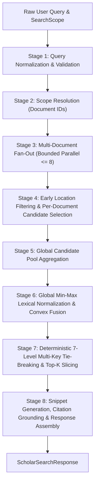

# Phase W3-E Architecture: Search / Retrieval Integration Stage

**Phase**: `W3-E — Search / Retrieval Integration Stage`  
**Status**: `PLANNING REVISED (PASS 2) / AWAITING IMPLEMENTATION AUTHORIZATION`  
**Repository**: `D:\RAJ\GITHUB_REPOSITORY\PROJECTS\AXORA-DESKTOP`  
**Target Solution**: `Axora-Desktop-WinUI\Axora.Desktop.sln`  
**Protected Git Baseline**: `96d8531560419eb9e9351575b3231aa27ab4a590` (`feat(winui): complete W3-D vector embedding and hybrid indexing`)  
**Preceding Closed Stages**: `W2-F`, `W3-B`, `W3-C.1..C.7.3`, `W3-D`  
**Downstream Dependents**: `DocumentChatService`, `ScholarKitViewModel`, `StudySynthesisEngine`

---

## 1. Architectural Overview & Component Hierarchy

Phase **W3-E** introduces the high-level retrieval subsystem (`ScholarSearchService`) that bridges consumer-facing ViewModels and synthesis engines with the underlying single-document vector indexes (`ScholarIndexService`) and document library storage (`ScholarLibraryService`).

```
┌─────────────────────────────────────────────────────────────────────────────┐
│                          DOWNSTREAM CONSUMERS                               │
│     [ScholarKitViewModel]      [DocumentChatService]    [StudySynthesis]   │
└──────────────────────────────────────┬──────────────────────────────────────┘
                                       │ (ScholarSearchRequest)
                                       ▼
┌─────────────────────────────────────────────────────────────────────────────┐
│                 IScholarSearchService / ScholarSearchService                │
│                                                                             │
│  1. Query Preprocessor & Sanitizer (Length bounding, whitespace trimming)   │
│  2. Scope Resolver (All / Session / Single / Explicit -> DocumentIds)       │
│  3. Bounded Multi-Doc Fan-Out Orchestrator (Parallel.ForEachAsync <= 8)     │
│  4. Early Location Filter (Evaluated prior to scoring)                      │
│  5. Deterministic Candidate Selector (Top 250 dense + Top 250 lexical)      │
│  6. Global Min-Max Lexical Normalizer (Cross-document score scaling)        │
│  7. Convex Hybrid Combiner (Alpha weighting, forced 0.0f if lexical-only)   │
│  8. Deterministic 7-Level Multi-Key Sorter (Tie-breaking)                   │
│  9. Snippet Extractor & Grounded Citation Binder (Zero hallucination)       │
└──────────────────────┬───────────────────────────────┬──────────────────────┘
                       │                               │
                       ▼                               ▼
┌────────────────────────────────────────┐ ┌──────────────────────────────────┐
│  IScholarIndexService (W3-D Storage)   │ │ IScholarLibraryService (W3-B)    │
│  - Vectors.bin & IndexManifest.json    │ │ - ScholarDocument metadata       │
│  - SimdVectorHelper (AVX2/FMA Dot)     │ │ - StudySession aggregate roots   │
│  - LexicalInvertedIndex (BM25)         │ │ - SourceAvailabilityStatus       │
│  - MemoryMappedFile Reader (Lock-free) │ │ - Quarantine directory           │
└────────────────────────────────────────┘ └──────────────────────────────────┘
```

---

## 2. End-to-End 8-Stage Retrieval Pipeline



### Stage 1: Query Normalization & Validation
- **Input**: `ScholarSearchRequest.QueryText`.
- **Operations**:
  1. Trim leading and trailing whitespace.
  2. Clamp maximum length to 2,000 characters; reject or truncate oversized inputs.
  3. Detect empty, whitespace-only, or pure-punctuation queries.
  4. If query produces 0 alphanumeric tokens, return `ScholarSearchResponse.Empty` with `SearchDegradationStatus.ZeroResults` immediately without invoking vector engines or opening disk files.
- **Output**: Clean query string and normalized token list.

### Stage 2: Scope Resolution
- **Input**: `ScholarSearchRequest.Scope`.
- **Operations**:
  1. `AllDocuments`: Inquires `IScholarLibraryService.ListDocumentsAsync()` to resolve all indexed document IDs.
  2. `SessionDocuments`: Loads `StudySession` via `IScholarLibraryService.LoadSessionAsync(sessionId)` and extracts `session.DocumentIds`.
  3. `SingleDocument`: Wraps target `DocumentId` in a single-element list.
  4. `ExplicitDocuments`: Validates and deduplicates the provided list of document IDs.
  5. Drops non-existent or invalid document IDs, recording structured warnings in `ScholarSearchResponse.Warnings`.

### Stage 3: Multi-Document Fan-Out Orchestration
- **Operations**:
  1. Executes across resolved documents with bounded parallel concurrency:
     ```csharp
     var parallelOptions = new ParallelOptions
     {
         MaxDegreeOfParallelism = Math.Clamp(Environment.ProcessorCount, 1, 8),
         CancellationToken = ct
     };
     ```
  2. Checks `ct.ThrowIfCancellationRequested()` before launching and at task boundaries.
  3. Gracefully catches per-document errors: if document $D_k$ fails index validation or is quarantined, records `SearchWarning(D_k, WARN_INDEX_QUARANTINED)` and does NOT abort the remaining parallel tasks.

### Stage 4: Early Location Filtering & Per-Document Candidate Selection
To eliminate ambiguity regarding candidate pool formation and strictly bound computational complexity, per-document candidate selection follows an explicit 4-step sequence:

1. **Early Location Filtering**:
   - For all records $r \in 	ext{Manifest.Records}$, evaluate `LocationFilter.Matches(r.PageNumber)`.
   - Records failing the filter are bypassed immediately before computing vector dot-products or lexical scores.
2. **Dense Candidate Selection (Top 250)**:
   - If dense semantic retrieval is active, evaluate cosine similarity $s_{	ext{vec}, i}$ for all passing records.
   - Filter to records with $s_{	ext{vec}, i} > 0.0f$.
   - Sort descending by $s_{	ext{vec}}$, breaking ties by `RecordIndex` ascending.
   - Select up to the top 250 dense candidates: $\mathcal{C}_{	ext{dense}}$.
   - If dense semantic retrieval is inactive (Class A mode or missing model), $\mathcal{C}_{	ext{dense}} = \emptyset$.
3. **Lexical Candidate Selection (Top 250)**:
   - Evaluate raw BM25 score $s_{	ext{bm25}, i}$ using `index.LexicalInvertedIndex`.
   - Filter to records with $s_{	ext{bm25}, i} > 0.0f$.
   - Sort descending by $s_{	ext{bm25}}$, breaking ties by `RecordIndex` ascending.
   - Select up to the top 250 lexical candidates: $\mathcal{C}_{	ext{lex}}$.
4. **Deduplicated Union & Quota Backfill (Bounded to $\le 500$)**:
   - Merge $\mathcal{C}_{	ext{dense}}$ and $\mathcal{C}_{	ext{lex}}$ into a deduplicated set $\mathcal{C}_{	ext{doc}}$ keyed by `RecordIndex` (or `WindowId`).
   - If $|\mathcal{C}_{	ext{doc}}| < 500$ and additional qualifying records with $s_{	ext{vec}} > 0 \lor s_{	ext{bm25}} > 0$ exist outside the top-250 cuts, backfill remaining capacity up to 500 total candidates by ordering remaining candidates by $\max(s_{	ext{vec}}, 	ext{doc\_raw\_bm25})$ descending, then `RecordIndex` ascending.
   - The resulting per-document candidate pool $\mathcal{C}_{	ext{doc}}$ satisfies $|\mathcal{C}_{	ext{doc}}| \le 500$ strictly.

### Stage 5: Global Candidate Pool Aggregation
- Combine the bounded candidate pools across all successfully queried documents:
  $$\mathcal{C} = igcup_{d \in 	ext{Scope}} \mathcal{C}_{	ext{doc}, d}$$
- If $\mathcal{C} = \emptyset$, return `ScholarSearchResponse.Empty` with `SearchDegradationStatus.ZeroResults`.

### Stage 6: Global Min-Max Lexical Normalization & Convex Fusion
To combine lexical BM25 scores with dense cosine similarity ($s_{	ext{vec}} \in [0.0, 1.0]$) across multiple documents, raw BM25 scores are normalized across the global candidate pool $\mathcal{C}$.

**Global Min-Max Normalization Algorithm**:
1. Find $\min_{\mathcal{C}} = \min_{c \in \mathcal{C}}(s_{	ext{bm25}, c})$ and $\max_{\mathcal{C}} = \max_{c \in \mathcal{C}}(s_{	ext{bm25}, c})$.
2. If $|\mathcal{C}| == 1$:
   $$s_{	ext{lex}, c} = egin{cases} 1.0f & 	ext{if } s_{	ext{bm25}, c} > 0 \ 0.0f & 	ext{otherwise} \end{cases}$$
3. If $\max_{\mathcal{C}} - \min_{\mathcal{C}} < 10^{-7}$:
   $$s_{	ext{lex}, c} = egin{cases} 1.0f & 	ext{if } \max_{\mathcal{C}} > 0 \ 0.0f & 	ext{otherwise} \end{cases}$$
4. Otherwise, for all $c \in \mathcal{C}$:
   $$s_{	ext{lex}, c} = 	ext{clamp}\left(rac{s_{	ext{bm25}, c} - \min_{\mathcal{C}}}{\max_{\mathcal{C}} - \min_{\mathcal{C}}}, 0.0f, 1.0f
ight)$$

**Convex Hybrid Fusion & Lexical-Only Enforcement**:
- If dense retrieval is active:
  $$lpha_{	ext{eff}} = 	ext{clamp}(	ext{HybridAlpha}, 0.0f, 1.0f)$$
  $$S_c = lpha_{	ext{eff}} \cdot s_{	ext{vec}, c} + (1.0f - lpha_{	ext{eff}}) \cdot s_{	ext{lex}, c}$$
- If dense retrieval is inactive (missing model or hardware failure):
  $$lpha_{	ext{eff}} = 0.0f$$
  $$s_{	ext{vec}, c} = 0.0f$$
  $$S_c = s_{	ext{lex}, c}$$

### Stage 7: Deterministic 7-Level Multi-Key Tie-Breaking & Slicing
To guarantee reproducible, deterministic search results across all platforms, candidate items are sorted using a strict 7-level multi-key comparator:

```csharp
var sortedHits = candidateHits
    .Where(c => c.CombinedScore >= request.MinScoreThreshold)
    .OrderByDescending(c => c.CombinedScore)                    // Key 1: Primary Hybrid Score
    .ThenByDescending(c => c.VectorScore)                      // Key 2: Dense Cosine Similarity
    .ThenByDescending(c => c.LexicalScore)                     // Key 3: Normalized BM25 Score
    .ThenBy(c => c.Record.DocumentId, StringComparer.Ordinal)  // Key 4: Document Identifier (Ordinal)
    .ThenBy(c => c.Record.PageNumber)                          // Key 5: Page Number (Ascending)
    .ThenBy(c => c.Record.FocalChunkIndex)                     // Key 6: Focal Chunk Index (Ascending)
    .ThenBy(c => c.Record.WindowId, StringComparer.Ordinal)    // Key 7: Window Identifier (Ordinal)
    .Take(request.TopK)
    .ToList();
```

### Stage 8: Snippet Generation, Grounded Citations & Response Assembly
For each top-K hit:
1. **Highlight-Aware Snippet Generation**:
   - Locate the occurrence of the highest-weight query terms in `BoundedContextWindow.FormattedText`.
   - Extract a contextual window of approximately 180–240 characters centered around the matched terms, bounded at word boundaries.
   - Prepend/append ellipsis (`...`) if truncated.
   - If no lexical term matched (pure dense hit), extract the opening 200 characters of `FormattedText`.
2. **Citation Grounding**:
   - Attach authoritative `StudyCitation` instances preserved in `VectorIndexRecord.Citations` or hydrated `BoundedContextWindow.Citations`.
   - Never generate synthetic citations.
3. **Source Disk Availability Check**:
   - Invoke `ScholarDocument.CheckSourceAvailability()` to flag whether the original source PDF/DOCX is physically present on disk.
4. **Rank Assignment**:
   - Assign sequential 1-based rank (`Rank = 1, 2, ..., K`).

---

## 3. Single-Document Parity Architecture

Single-document queries (`SearchDocumentAsync` or `SearchScope.Single(docId)`) are architected to maintain exact ranking parity with W3-D:
- Reuses the authoritative W3-D single-document candidate selection and scoring path (`IScholarIndexService.SearchHybridAsync`) or its exact candidate formulation logic directly.
- Ensures identical tie-breaker ordering: keys 1 through 7 match W3-D's 7-level comparator.
- Verified via regression test fixtures comparing W3-E and W3-D outputs for ranking parity and floating-point score equivalence within IEEE 754 precision ($\Delta \le 10^{-6}$).

---

## 4. Measurable Performance Verification Framework

### 4.1 Retrieval Operational States:
- **Cold Retrieval**: First query invocation following process startup or index cache eviction. Incurs one-time file stream reading or memory-mapped file initialization and inverted index reconstruction.
- **Warm Retrieval**: Subsequent query invocations on cached, memory-resident `ScholarVectorIndex` instances with initialized memory buffers.

### 4.2 Measurement Boundary Definitions:
- **Model Initialization**: One-time ONNX Runtime session creation and DirectML device compilation (500ms–2000ms) is **EXCLUDED** from query latency and measured separately as `ModelInitializationLatency`.
- **Snippet Extraction & Metadata Verification**: In-memory snippet extraction and fast disk file existence checks (`File.Exists`) are **INCLUDED** in query latency.

### 4.3 Standard Test Fixture Specifications:
1. **Small Fixture**: 1 document, 100 context windows (~100 vectors).
2. **Medium Fixture (Multi-Doc Session)**: 5 documents, 2,000 context windows (~2,000 vectors).
3. **Stress Fixture**: 10 documents, 10,000 context windows (~10,000 vectors).

### 4.4 Measurement Protocol & Statistical Reporting:
- Execute $N=20$ benchmark iterations per fixture. Discard iteration 1 for warm benchmarks.
- Record elapsed durations in milliseconds using high-resolution timestamping (`Stopwatch.GetTimestamp()`).
- Report both $p50$ (median) and $p95$ (95th percentile).
- Log test environment telemetry: CPU architecture, core count, RAM, OS build, and active execution provider (DirectML GPU or CPU).

### 4.5 Quantitative Latency Budgets (Warm Retrieval, p95):
- Single-Document Hybrid (Small Fixture, 100 vectors): $\le 30	ext{ ms}$.
- Single-Document Hybrid (Medium Fixture, 2,000 vectors): $\le 75	ext{ ms}$.
- Multi-Document Session Hybrid (Medium Fixture, 5 docs, 2,000 vectors): $\le 150	ext{ ms}$.
- Multi-Document Lexical-Only (Medium Fixture, 5 docs): $\le 60	ext{ ms}$.
