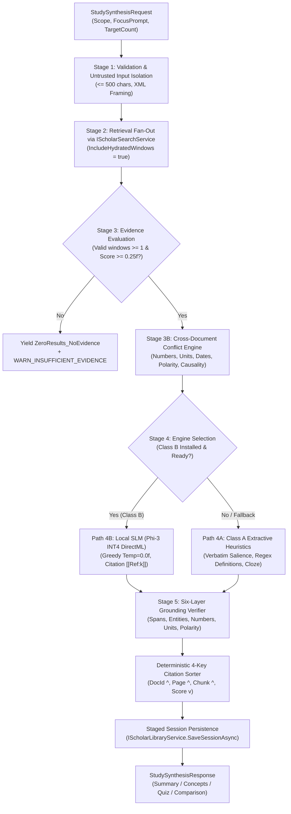

# Phase W3-F Architecture: Study Synthesis Engine

**Phase**: `W3-F — Study Synthesis Engine`  
**Status**: `PLANNING HARDENED (PASS 2) / AWAITING IMPLEMENTATION AUTHORIZATION`  
**Repository**: `D:\RAJ\GITHUB_REPOSITORY\PROJECTS\AXORA-DESKTOP`  
**Target Solution**: `Axora-Desktop-WinUI\Axora.Desktop.sln`  
**Protected Git Baseline**: `a3dad9325f3fcf30ab4b71b088a2047e44a216ce` (`feat(winui): complete W3-E search and retrieval integration`)  
**Preceding Closed Stages**: `W2-F`, `W3-B`, `W3-C.1..C.7.3`, `W3-D`, `W3-E`  
**Downstream Dependents**: `ScholarKitViewModel`, `FlashcardsViewModel`, `DocumentChatService`

---

## 1. Architectural Overview & Component Hierarchy

Phase **W3-F** establishes the local academic synthesis engine that converts raw, retrieved context windows into structured study aids (Executive Summaries, Concepts, Practice Quizzes, and Comparative Analyses).

```
┌─────────────────────────────────────────────────────────────────────────────┐
│                          DOWNSTREAM CONSUMERS                               │
│  [ScholarKitViewModel]    [FlashcardsViewModel]    [DocumentChatService]    │
└──────────────────────────────────────┬──────────────────────────────────────┘
                                       │ (StudySynthesisRequest)
                                       ▼
┌─────────────────────────────────────────────────────────────────────────────┐
│                       ScholarSynthesisEngine                                │
│                                                                             │
│  Stage 1: Request Validation & Untrusted Instruction Delimitation           │
│  Stage 2: Retrieval Fan-Out via IScholarSearchService (Hydrated Windows)    │
│  Stage 3: Evidence Evaluation & Cross-Document Conflict Detection Engine    │
│  Stage 4: Multi-Engine Synthesis Dispatcher                                 │
│           ├── Path 4A: ExtractiveHeuristicSynthesizer (Class A - Bundled)   │
│           ├── Path 4B: LocalSlmSynthesizer (Class B - IScholarSlmDriver)    │
│           └── Path 4C: GuardedRemoteSynthesizer (Class C - Opt-In Guarded)  │
│  Stage 5: Six-Layer Grounding Verifier, Citation Sorter & Persistence       │
└──────────────────────┬───────────────────────────────┬──────────────────────┘
                       │                               │
                       ▼                               ▼
┌────────────────────────────────────────┐ ┌──────────────────────────────────┐
│  IScholarSearchService (W3-E Engine)   │ │ IScholarLibraryService (W3-B)    │
│  - Multi-document query fan-out        │ │ - StudySession JSON persistence  │
│  - BoundedContextWindow hydration      │ │ - Staged replacement semantics   │
│  - Authenticated StudyCitation origin  │ │ - User edit preservation logic   │
└────────────────────────────────────────┘ └──────────────────────────────────┘
```

---

## 2. End-to-End 5-Stage Synthesis Pipeline



### Stage 1: Request Validation & Untrusted Instruction Delimitation
- Focus instructions are treated as **untrusted user data**.
- Clamped strictly to $\le 500$ characters. Control characters are stripped.
- Isolated inside delimiter tags: `<user_focus_topic>...</user_focus_topic>`.
- Parameter bounds: `TargetItemCount` $\in [1, 20]$ for concepts, $[1, 10]$ for quizzes; `MaxContextWindows` $\in [1, 10]$.

### Stage 2: Retrieval Fan-Out via `IScholarSearchService`
- Dispatches `IScholarSearchService.SearchAsync` with `IncludeHydratedWindows = true`.
- Collects `ScholarSearchResponse.Items`, retaining `HydratedWindow` and `Citations`.

### Stage 3: Evidence Evaluation & Cross-Document Conflict Engine
- **Sufficiency Check**: Filters items where `CombinedScore >= MinRelevanceThreshold`. If passing windows $== 0$, emits `ZeroResults_NoEvidence` with `WARN_INSUFFICIENT_EVIDENCE`.
- **Conflict Rules Engine**:
  - Compares statements across distinct `DocumentId`s for:
    1. Numbers ($V_A \ne V_B$)
    2. Units of measurement
    3. Dates and chronology
    4. Percentages
    5. Polarity / Negation ("inhibits" vs "promotes" or "not")
    6. Opposing categorical values ("malignant" vs "benign")
    7. Contradictory causality ("A causes B" vs "B causes A" or "A prevents B")
  - **Ambiguous Cases**: If the engine cannot establish certainty (e.g. varying test conditions), it marks `IsAmbiguous = true` and labels the item `PotentialDiscrepancy_Ambiguous`, preserving both citations without declaring a factual conflict.

### Stage 4: Multi-Engine Synthesis Dispatcher

#### Path 4A: Class A Extractive Heuristic Engine (Bundled Core, 0 MB)
- **Sentence Salience Scoring**:
  - Segment text into sentences; compute TF-IDF salience score:
    $$\text{Salience}(s) = \left( \sum_{w \in s} TF(w) \cdot IDF(w) \right) \cdot \text{PositionWeight}(s)$$
  - Highest-scoring sentence selected as `CoreThesis`.
  - Next $N$ non-redundant sentences selected as `KeyPoints` (pairwise Jaccard overlap $\le 0.40$).
- **Definition & Concept Extraction**:
  - Applies high-precision regex/syntactic patterns on source text:
    - `^([A-Z][A-Za-z0-9\s\-]{2,35}):\s+(.+)`
    - `^([A-Z][A-Za-z0-9\s\-]{2,35})\s+(?:is defined as|refers to|denotes|is described as)\s+(.+)`
  - Definitions clamped to $\le 300$ chars; categorized into *Core Concept*, *Definition*, *Methodology*, *Formula*.
- **Practice Quiz Generation**:
  - Converts definitions into active-recall questions ("What is the primary definition and role of {Term}?").
  - Transforms causal clauses into explanation prompts ("Explain the underlying mechanism of: {Clause}.").
  - Calculates difficulty (*Easy*, *Medium*, *Hard*) from sentence complexity.

#### Path 4B: Class B Local SLM Engine (Microsoft Phi-3-mini-4k-instruct ONNX DirectML)
- Implements `IScholarSlmModelDriver`.
- Bounded prompt with numbered context windows `[Context 1] ... [Context N]`.
- Strict closed-book prompt: *"Use ONLY provided context. Every claim must include inline reference [[Ref:k]]. Do NOT extrapolate."*
- Greedy decoding (`temp = 0.0f`, `top_p = 1.0f`) to maximize reproducibility.
- Parses output into structured response objects, mapping `[[Ref:k]]` to window citations.

### Stage 5: Six-Layer Grounding Verifier, Citation Sorter & Persistence
- Evaluates every synthesized item across all six layers:
  - Layer A: Citation validity
  - Layer B: Span containment
  - Layer C: Lemma overlap ($\ge 60\%$)
  - Layer D: Number, date, percentage, unit, and entity consistency
  - Layer E: Polarity and causal direction
  - Layer F: Rejection of unsupported items
- Sets `ItemGroundingStatus` (`Grounded`, `PartiallyGrounded`, `ConflictDetected`, `Unverified`, `Unsupported`).
- Deterministic 4-key citation sort: `DocId` $\uparrow$, `Page` $\uparrow$, `Chunk` $\uparrow$, `Score` $\downarrow$.
- Staged persistence in `StudySession`, preserving items with `IsUserModified == true`.

---

## 3. Concurrency, Memory & Lifecycle Management

### 3.1 Session Serialization
- Concurrent synthesis calls on the same `StudySession` are serialized via a session-keyed `SemaphoreSlim(1, 1)`.
- Concurrent calls across distinct sessions run in parallel up to $\min(\text{ProcessorCount}, 4)$.

### 3.2 Memory & VRAM Lifecycle
- **Class A Mode**: CPU string processing; peak memory overhead $\le 35\text{ MB}$.
- **Class B Mode**: Model loaded lazily upon first request; peak footprint $\le 2.2\text{ GB}$. An idle timer (10 minutes) unloads model weights when inactive to reclaim VRAM/RAM.

### 3.3 Cancellation Responsiveness
- Polled at loop boundaries and inside token generation loops; aborts within $\le 50\text{ ms}$, freeing intermediate buffers cleanly.
